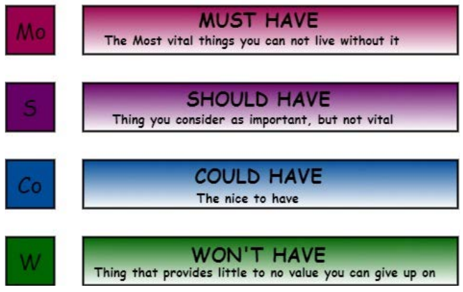

O MVP refere-se ao conjunto mínimo de funcionalidades que permite que o produto seja lançado e utilizado pelos clientes. Ele foca nos recursos essenciais necessários para testar o mercado e validar as principais hipóteses de valor de negócio.

A equipe optou por utilizar a técnica de priorização de backlog MoSCoW, que separa as funcionalidades em quatro categorias:
- **Mo - Must have.** São os requisitos que **devem** estar contido no projeto. Falhar na entrega desses requisitos é o mesmo que dizer que o projeto foi uma falha.
- **S - Should have.** São requisitos de alta prioridade, mas não cruciais para o lançamento. São importantes e agregam alto valor aos usuários. Devem preencher o segundo lugar da fila de prioridade.
- **Co - Could have.** São requisitos desejáveis, mas que não são necessários. Menor importantes que os requisitos do grupo "should have".
- **W - Won't have.** Requisitos que não serão implementados, mas que podem ser incluídos futuramente.

 

Figura 1: MoSCoW (HUDAIB et al., 2018)

| ID   | Descrição                                   | Prioridade  | MVP |
|------|--------------------------------------------|-------------|-----|
| US01 | Acessar histórico da equipe                | Must have   | X   |
| US02 | Visualizar os projetos da equipe           | Must have   | X   |
| US03 | Visualizar os prêmios da equipe            | Must have   | X   |
| US04 | Contactar a equipe                         | Should have   |   |
| US05 | Postar conteúdo                            | Could Have  |     |
| US06 | Excluir conteúdo                           | Could Have  |     |
| US07 | Editar área pública                        | Must have   | X   |
| US08 | Cadastrar membros                          | Must have   | X   |
| US09 | Atualizar núcleo, faltas e advertências    | Must have | X   |
| US10 | Consultar lista de membros                 | Must have |     |
| US11 | Excluir membro                             | Must have   | X   |
| US12 | Cadastrar reunião                          | Must have   | X   |
| US13 | Atualizar reunião                          | Must have   | X   |
| US14 | Notificar reunião                          | Should have |     |
| US15 | Realizar chamada em reunião                | Must have   | X   |
| US16 | Notificar falta                            | Could have  |     |
| US17 | Justificar falta                           | Should have |     |
| US18 | Avaliar justificativa de falta             | Should have |     |
| US19 | Gerar alerta                               | Should Have |     |
| US20 | Criar lista de materiais                   | Must have | X   |
| US21 | Adicionar, modificar ou remover material.  | Must have | X   |
| US22 | Visualizar lista de materiais              | Must have   | X   |
| US23 | Marcar material que está em uso            | Should have  |     |
| US24 | Solicitar compra de materiais              | Should have  |     |
| US25 | Gerar relatório de materiais               | Should have | |

## Histórico de versão 
|**Data**|**Versão** |**Descrição** |**Autor**|
| :- | :- | :- | :- |
|**02/05/25**| 0.1 | Construindo o documento de MVP | Equipe |
|||||
|||||