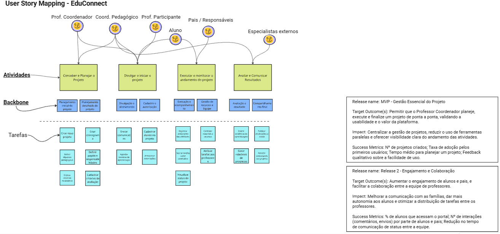

# User Story Mapping - EduConnect

Utilizamos a técnica de User Story Mapping (USM) para estruturar o Product Backlog da EduConnect, uma plataforma digital voltada a facilitar a criação, gestão e avaliação de projetos educacionais interdisciplinares, bem como o acompanhamento de atividades extracurriculares no ambiente escolar.

<iframe
    width="768"
    height="432"
    src="https://miro.com/app/live-embed/uXjVIqQl0t0=/?embedMode=view_only_without_ui&moveToViewport=-2375,-1309,3802,1896&embedId=308568922764"
    frameborder="0"
    scrolling="no"
    allow="fullscreen; clipboard-read; clipboard-write"
    allowfullscreen
></iframe>

## 🗺️ USM Board

## 👥 Personas

| ID    | Persona               |
|-------|------------------------|
| Us01  | Prof. Coordenador      |
| Us02  | Coord. Pedagógico      |
| Us03  | Prof. Participante     |
| Us04  | Aluno                  |
| Us05  | Pais / Responsáveis    |
| Us06  | Especialistas Externos |

---

## 📌 Atividades e Responsáveis

| Atividade                                      | ID       | Responsáveis             |
|------------------------------------------------|----------|---------------------------|
| Conceber e planejar o projeto                  | At01     | Us01, Us02                |
| Divulgar e iniciar o projeto                   | At02     | Us01, Us02, Us03, Us04    |
| Executar e monitorar o andamento do projeto    | At03     | Us04, Us05                |
| Avaliar e comunicar resultados                 | At04     | Us02, Us06                |

---

## 🧱 Backbone e Atividades Associadas

| ID    | Backbone                               | Atividade Associada |
|-------|-----------------------------------------|----------------------|
| Bb01  | Planejamento inicial do projeto         | At01                 |
| Bb02  | Planejamento detalhado do projeto       | At01                 |
| Bb03  | Divulgação e alinhamento                | At02                 |
| Bb04  | Cadastro de participantes e autorização | At02                 |
| Bb05  | Execução e acompanhamento               | At03                 |
| Bb06  | Gestão de recursos e equipe             | At03                 |
| Bb07  | Avaliação e resultados                  | At04                 |
| Bb08  | Compartilhamento final                  | At04                 |

---

## ✅ MVP - Mínimo Produto Viável

| Tarefa | Descrição                                 | Backbone
|--------|-------------------------------------------|----------
| T01    | Criar novo projeto                        | Bb01     
| T02    | Definir objetivos pedagógicos             | Bb01     
| T03    | Estimar recursos necessários              | Bb01     
| T04    | Criar cronograma                          | Bb02     
| T05    | Definir papéis e responsabilidades        | Bb02     
| T06    | Definir critérios de avaliação            | Bb02     
| T07    | Agendar reuniões de apresentação          | Bb03     
| T08    | Enviar comunicados                        | Bb03     
| T09    | Cadastrar alunos no projeto               | Bb04     
| T10    | Armazenar autorizações dos pais           | Bb04     
| T11    | Registrar andamento das atividades        | Bb05     
| T12    | Marcar tarefas como concluídas            | Bb05     
| T13    | Visualizar o andamento do projeto         | Bb05     
| T14    | Controlar materiais e recursos            | Bb06     
| T15    | Inserir evidências de aprendizagem        | Bb07     
| T16    | Avaliar o progresso do aluno              | Bb07     
| T17    | Publicar atualizações e avisos            | Bb08     
| T18    | Visualizar feedbacks fornecidos           | Bb08     

---

## 📋 Detalhamento por Backbone

### 🔹 BB01 – Planejamento Inicial do Projeto

#### US01
**User Story:**  
Como **Professor Coordenador**, quero **criar um novo projeto com nome, objetivo e disciplinas**, para que **eu possa começar a organizar e documentar desde o início**.

**Critérios de Aceitação:**
- O sistema deve permitir a criação de projeto com nome, objetivos e disciplinas.
- O projeto pode ser salvo como rascunho.
- O projeto pode ser editado posteriormente.

---

#### US02
**User Story:**  
Como **Professor Coordenador**, quero **definir objetivos pedagógicos para o projeto**, para que **os professores participantes tenham clareza sobre as metas educacionais**.

**Critérios de Aceitação:**
- O sistema deve permitir a inserção e edição dos objetivos pedagógicos.
- Os objetivos devem estar vinculados ao projeto.
- Deve haver visualização clara dos objetivos para todos os envolvidos.

---

#### US03  
**User Story:**  
Como **Professor Coordenador**, quero **estimar os recursos necessários**, para que **possamos garantir o suporte adequado ao longo do projeto**.

**Critérios de Aceitação:**
- O sistema deve permitir a listagem de recursos (materiais, equipe, orçamento).
- Os recursos devem ser associados ao projeto.
- Deve ser possível revisar e atualizar os recursos estimados.

---

### 🔹 BB02 – Planejamento Detalhado

#### US04  
**User Story:**  
Como **Professor Coordenador**, quero **criar um cronograma com marcos e datas editáveis**, para que **eu possa planejar e acompanhar o progresso do projeto**.

**Critérios de Aceitação:**
- Deve ser possível adicionar marcos com nome, descrição e data.
- O cronograma deve ser editável.
- As alterações devem ser salvas e visíveis a todos os envolvidos.

---

#### US05  
**User Story:**  
Como **Coordenador Pedagógico**, quero **atribuir papéis e responsabilidades a cada membro da equipe**, para que **todos saibam o que é esperado de si**.

**Critérios de Aceitação:**
- Deve ser possível atribuir papéis aos usuários cadastrados.
- As responsabilidades devem estar claramente descritas.
- Os usuários devem ser notificados das suas atribuições.

---

#### US06  
**User Story:**  
Como **Coordenador Pedagógico**, quero **definir critérios de avaliação associados às atividades**, para que **os resultados possam ser medidos de forma justa e padronizada**.

**Critérios de Aceitação:**
- Deve ser possível criar, editar e excluir critérios de avaliação.
- Os critérios devem estar associados a atividades específicas.
- Os critérios devem estar acessíveis aos professores e coordenadores.

---

### 🔹 BB03 – Divulgação e Alinhamento

#### US07  
**User Story:**  
Como **Professor Coordenador**, quero **agendar reuniões de apresentação**, para que **todos os envolvidos entendam o escopo do projeto desde o início**.

**Critérios de Aceitação:**
- Deve ser possível agendar reuniões com data, hora e descrição.
- Os participantes devem receber notificações da reunião.
- Deve ser possível registrar a realização da reunião.

---

#### US08  
**User Story:**  
Como **Professor Participante**, quero **receber comunicados personalizados**, para que **eu esteja sempre atualizado sobre as fases do projeto**.

**Critérios de Aceitação:**
- O sistema deve permitir o envio de comunicados para públicos distintos.
- Os comunicados devem incluir título, mensagem e anexos opcionais.
- Os usuários devem receber os comunicados via sistema e/ou e-mail.

---

### 🔹 BB04 – Cadastro e Autorização

#### US09  
**User Story:**  
Como **Aluno**, quero **ser cadastrado no projeto com meus dados básicos**, para que **eu possa participar formalmente das atividades**.

**Critérios de Aceitação:**
- O sistema deve permitir o cadastro de alunos com nome, série, turma e dados de contato.
- O aluno deve ser vinculado ao projeto específico.
- O coordenador deve conseguir visualizar a lista de alunos cadastrados.

---

#### US10  
**User Story:**  
Como **Pai/Responsável**, quero **autorizar digitalmente a participação do meu filho**, para que **ele possa integrar-se ao projeto sem complicações burocráticas**.

**Critérios de Aceitação:**
- Deve haver uma funcionalidade de envio de termo de autorização digital.
- O responsável deve poder assinar eletronicamente.
- O status da autorização deve ficar visível para os coordenadores.

---

### 🔹 BB05 – Execução e Acompanhamento

#### US11  
**User Story:**  
Como **Aluno**, quero **registrar o andamento das minhas atividades**, para que **eu possa acompanhar meu progresso**.

**Critérios de Aceitação:**
- O aluno deve poder registrar atualizações em suas tarefas.
- O sistema deve armazenar um histórico dessas atualizações.
- As atualizações devem ser visíveis pelos professores.

---

#### US12  
**User Story:**  
Como **Professor Participante**, quero **marcar tarefas como concluídas**, para que **os coordenadores vejam o andamento da turma**.

**Critérios de Aceitação:**
- As tarefas devem ter um botão ou ação para marcar como "concluída".
- Deve ser possível adicionar observações ao concluir uma tarefa.
- O status de conclusão deve aparecer no painel do projeto.

---

#### US13  
**User Story:**  
Como **Professor Coordenador**, quero **visualizar o status geral do projeto**, para que **eu possa intervir quando necessário**.

**Critérios de Aceitação:**
- O sistema deve exibir uma visão geral do progresso das tarefas por aluno ou equipe.
- Deve ser possível filtrar por status, responsável ou data.
- Alertas devem ser exibidos para tarefas atrasadas ou pendentes.

---

### 🔹 BB06 – Gestão de Recursos e Equipe

#### US14  
**User Story:**  
Como **Professor Coordenador**, quero **controlar materiais e recursos por etapa**, para que **o uso seja eficiente e não falte nada durante o projeto**.

**Critérios de Aceitação:**
- Deve ser possível registrar recursos disponíveis e seu uso por atividade.
- Alertas devem ser enviados quando os estoques estiverem baixos.
- Um histórico de uso deve ser acessível para consulta.

---

### 🔹 BB07 – Avaliação e Resultados

#### US15  
**User Story:**  
Como **Professor Participante**, quero **inserir evidências de aprendizagem dos alunos**, para que **os avaliadores tenham uma base real para análise**.

**Critérios de Aceitação:**
- Deve ser possível anexar fotos, vídeos ou documentos organizados por aluno.
- Cada evidência deve ser vinculada a uma atividade ou critério.
- As evidências devem ficar acessíveis a professores e coordenadores.

---

#### US16  
**User Story:**  
Como **Coordenador Pedagógico**, quero **avaliar o progresso dos alunos com base nas evidências**, para que **o desempenho seja bem documentado**.

**Critérios de Aceitação:**
- Deve haver uma interface para visualizar as evidências e atribuir avaliações.
- Os relatórios devem ser gerados automaticamente por aluno, grupo ou projeto.
- O sistema deve permitir comentários e feedbacks qualitativos.

---

### 🔹 BB08 – Comunicação Contínua

#### US17  
**User Story:**  
Como **Professor Coordenador**, quero **publicar atualizações e avisos no mural**, para que **todos os stakeholders acompanhem as novidades**.

**Critérios de Aceitação:**
- Deve ser possível publicar avisos com texto, imagens e anexos.
- Os avisos devem ter opção de menção a usuários.
- Todos os usuários devem ser notificados ao receber um novo aviso.

---

#### US18  
**User Story:**  
Como **Aluno**, quero **visualizar e comentar nos avisos e atividades**, para que **eu possa tirar dúvidas e interagir com o projeto**.

**Critérios de Aceitação:**
- Os alunos devem poder comentar nas publicações visíveis a eles.
- Os comentários devem permitir marcação de usuários e anexos simples.
- Deve haver controle de visibilidade e moderação para os comentários.
