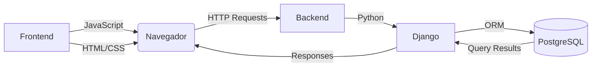

# 🚀 Capital Nexus

Capital Nexus é uma solução web integrada para gestão operacional da equipe de competição Capital Rocket Team (CRT) 

 

---

## 👥 Integrantes do Projeto

  

    
    

      
Sophia Silva

      <a href="https://github.com/sophiassilva" class="github-link" target="_blank">@sophiassilva</a>
    

  

  

    
    

      
Wanjo Christopher

      <a href="https://github.com/wChrstphr" class="github-link" target="_blank">@wChrstphr</a>
    

  

  

    
    

      
Kaio Macedo

      <a href="https://github.com/bigkaio" class="github-link" target="_blank">@bigkaio</a>
    

  

  

    
    

      
Víctor Câmara

      <a href="https://github.com/victorcamaraa" class="github-link" target="_blank">@victorcamaraa</a>
    

  

  

    
    

      
Maria Clara

      <a href="https://github.com/mclarasenaa" class="github-link" target="_blank">@mclarasenaa</a>
    

  

  

    
    

      
Pedro Henrique

      <a href="https://github.com/PhFariaa" class="github-link" target="_blank">@PhFariaa</a>
    

  

---

## ⚙️ Tecnologias Utilizadas

  <!-- Frontend Layer -->
  

    
Frontend

    

      

        
JS

        

          
JavaScript

          
Lógica e interatividade

        

      

      

        
H

        

          
HTML5

          
Estrutura de páginas

        

      

      

        
C

        

          
CSS3

          
Estilização e design

        

      

    

  

  <!-- Backend Layer -->
  

    
Backend

    

      

        
Py

        

          
Python

          
Lógica de servidor

        

      

      

        
Dj

        

          
Django

          
Framework web

        

      

    

  

  <!-- Database Layer -->
  

    
Banco de Dados

    

      

        
DB

        

          
PostgreSQL

          
Banco de dados relacional

        

      

    

  

### 🌐 **Arquitetura do Sistema**

