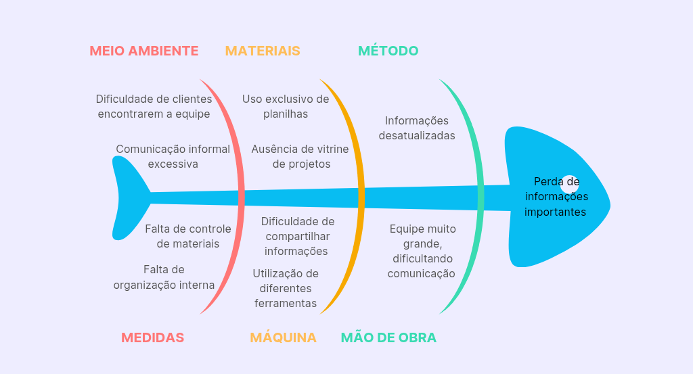

# Cenário atual do Cliente e do Negócio

## 💼 Introdução ao Negócio e Contexto

A **Capital Rocket Team (CRT)** é uma equipe de competição de aeromodelismo da **Universidade de Brasília (UnB)**. Fundada no ano de **2015**, tem como objetivo representar a universidade em **competições nacionais e internacionais**, além de promover a **capacitação dos estudantes** e **desenvolvimento dos subsistemas** com tecnologia nacional relativas à foguetes. 

A equipe conta com diversas conquistas ao longo de sua jornada, como o **1° e 2° lugar em 2022 e 2021** na **Latin American Space Challenge (LASC)**, **2ª maior competição experimental de engenharia de foguetes do mundo**. A CRT também se destaca por ser a **única equipe da América Latina a lançar um foguete de propulsão híbrida**, foco principal da equipe.

Apesar de todas as suas conquistas, a equipe enfrenta alguns problemas de **divulgação dos seus projetos** e na **gestão de pessoas e controle de estoques**.

## 💡 Identificação da Oportunidade ou Problema
A principal oportunidade identificada para a equipe é a **facilitação de divulgação do seu trabalho**, uma vez que atualmente suas informações e projetos estão espalhados por diferentes meios de comunicação, o que dificulta que **patrocinadores em potencial tenham acesso fácil e integral ao seu trabalho**.

No gerenciamento interno, a oportunidade principal é a **utilização de um sistema centralizado** que facilite o **acompanhamento individual dos membros** (como faltas, advertências e strikes), que atualmente é feito por planilhas, além do **controle de estoques**, onde os integrantes da equipe tenham acesso aos materiais disponíveis e solicitem a sua utilização ou realizem pedidos dos outros, que atualmente é feita pessoalmente. 

A figura a seguir apresenta o **diagrama de Ishikawa**, contendo as causas e o problema da CRT.

 

Figura 1: Diagrama de Ishikawa

## ⛰️ Desafios do Projeto

O principal desafio do projeto será **integrar seus dados ao novo sistema de gerenciamento**, uma vez que a equipe mantêm grande parte de suas informações em planilhas, além da equipe possuir atualmente **55 membros**.

Outro desafio é que a equipe já possuía um site anterior, porém o responsável por manter o domínio teve um problema e acabou apagando todas as informações que estavam no ar. Embora ainda possuam o domínio, a equipe **não tem o conhecimento necessário para manter o site**. Por isso, o domínio deve ser reaproveitado e o novo projeto deve ser de **fácil manutenção**, permitindo que a própria equipe possa gerenciá-lo.

## 👤 Segmentação de clientes

A equipe tem, em geral, **três tipos de clientes**:

1. **Entusiastas**: Pessoas de 18 à 30 anos, amantes de tecnologia e engenharia aeroespacial, que acompanham e apoiam o projeto;
1. **Patrocinadores**: Empresas que produzem materiais do setor (como fibra de vidro) ou entusiastas que patrocinam a equipe por conta de sua relevante atuação na área;
1. **Membros**: Estudantes da Universidade de Brasília (UnB), com idade entre 18 a 25 anos, que se voluntariam com o objetivo de competir e aprender.

## 📜 Histórico de Versão

|**Data**|**Versão** |**Descrição** |**Autor**|
| :- | :- | :- | :- |
|**06/04/25**|1.0|Primeira versão|Sophia |
|**02/05/25**|1.1|Correção do diagrama de ishikawa|Sophia|
|**02/05/25**|1.2|Detalhamento dos clientes|Sophia|
|**13/07/25**|2.0|Refinando visualmente o documento|Wanjo Christopher|