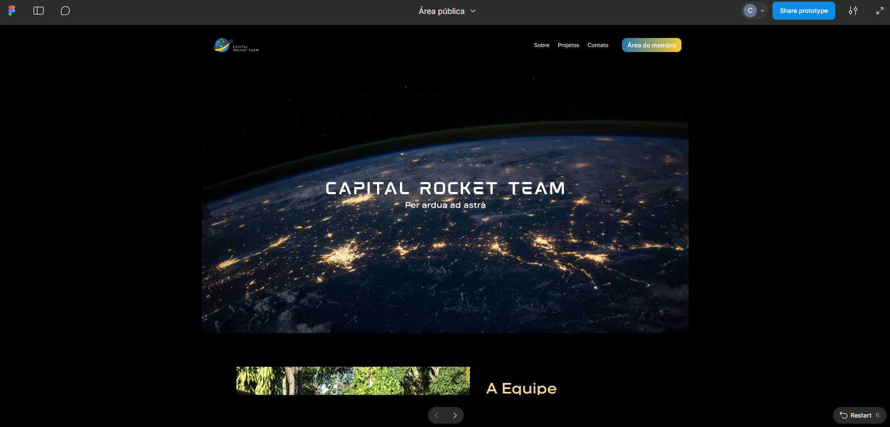

# Evidências da Engenharia de Requisitos

## 🔍 Elicitação e Descoberta

### Entrevistas e Reuniões com Cliente

| Data      | Tipo           | Participantes                | Objetivo/Descrição                                                                                   |
|-----------|----------------|-----------------------------|------------------------------------------------------------------------------------------------------|
| 01/04     | Kick off       | Cliente Filipe, equipe      | Alinhamento de expectativas, definição de objetivos e escopo, entrevista aberta                      |
| 15/05     | Reunião        | Cliente, equipe             | Atualização do andamento do projeto, disponibilização do documento de visão                          |
| 21/05     | Reunião        | Cliente, equipe, marketing  | Discussão sobre área interna, definição de template de dashboard                                     |
| Diversas  | Conversas assíncronas     | Cliente, equipe             | Validação e dúvidas tiradas via WhatsApp                                                            |

A reunião de **Kick-off** foi realizada no dia **01/04**, com o cliente Filipe, na plataforma Teams. O objetivo foi realizar alinhamento de expectativas, definir objetivos e escopo do projeto. Foi feita uma entrevista aberta. A partir disso, a equipe começou a trabalhar no levantamento de requisitos. Dúvidas foram tiradas nos dias posteriores por WhatsApp com o cliente.

No dia **15/05**, foi realizado mais uma reunião com o cliente para **atualizar o cliente do andamento do projeto** e foi disponibilizado o documento de visão do produto elaborado até então para o acesso do próprio e também verificar alguns pontos importantes definidos.

No dia **21/05** foi feito uma reunião com o cliente e um membro de marketing da equipe para tratar da área interna, e foi acordado a utilização de um **template de dashboard para a área interna da plataforma**. 

A equipe começou a configuração do ambiente e a trabalhar os **critérios de aceitação no formato BDD** junto com o cliente para o desenvolvimento dos requisitos, as validações foram feitas por meio do WhatsApp.

### User Stories para Elicitação

Foi utilizado **User Story** como técnica para elicitar e descobrir os requisitos a partir do ponto de vista do usuário, garantindo foco nas necessidades reais dos stakeholders. [Veja aqui o backlog completo](https://mdsreq-fga-unb.github.io/2025.1-T01-CapitalNexus/backlog/geral/)

## 🤝 Análise e Consenso

### Reuniões de Validação e Refinamento

| Data      | Tipo           | Participantes                | Objetivo/Descrição                                                                                   |
|-----------|----------------|-----------------------------|------------------------------------------------------------------------------------------------------|
| 25/04     | Reunião        | Cliente, equipe             | Análise e consenso do backlog inicial, validação e correção de requisitos                            |

No dia **25/04**, foi feita reunião com o cliente para a **análise e consenso do backlog inicial** levantado durante as duas semanas em que estivemos trabalhando. Algumas coisas precisaram ser corrigidas e a maioria dos requisitos levantados inicialmente foram validados.

### Análise de Domínio de Requisitos

Foi utilizada análise de domínio de requisito para resolver contradições, eliminar ambiguidades e complementar informações ausentes nos requisitos elicitados. Essa **análise foi feita em conjunto com o cliente** na reunião acima e por mensagens via WhatsApp.

### Prompt IA para Análise

O Prompt IA foi utilizado para fazer uma **análise dos requisitos**, resolver contradições e alinhar as perspectivas, de uma **forma mais direta e eficiente**.

## 🎨 Representação de Requisitos

### Prototipação Navegável

Para a área pública da plataforma, foi feito um **protótipo navegável** do Figma, disponível [aqui](https://www.figma.com/proto/oLr46TFUlHuLrmSEJycHma/%C3%81rea-p%C3%BAblica?node-id=133-456&p=f&t=bxoh3RmmTK3w1HFY-1&scaling=scale-down&content-scaling=fixed&page-id=0%3A1&starting-point-node-id=133%3A456).

### Entrega e Validação do Protótipo

| Data      | Tipo           | Participantes                | Objetivo/Descrição                                                                                   |
|-----------|----------------|-----------------------------|------------------------------------------------------------------------------------------------------|
| 16/05     | Entrega protótipo | Cliente, equipe           | Entrega e validação do protótipo da área pública/site                                                |

## 📝 Declaração de Requisitos

### Documento de Visão

Os requisitos estão declarados no **Documento de Visão** disponível no GitPages do projeto em [Backlog Geral](https://mdsreq-fga-unb.github.io/2025.1-T01-CapitalNexus/backlog/geral/). 

### User Stories e Estruturação

Os requisitos foram declarados usando [**User Story, Épicos e Features**](https://mdsreq-fga-unb.github.io/2025.1-T01-CapitalNexus/backlog/geral/#estrutura-do-backlog), garantindo foco em entregas de valor sob a perspectiva do usuário.

### Critérios de Aceitação BDD

A equipe começou a trabalhar os [**critérios de aceitação no formato BDD**](https://mdsreq-fga-unb.github.io/2025.1-T01-CapitalNexus/backlog/geral/#backlog) junto com o cliente para o desenvolvimento dos requisitos, as validações foram feitas por meio do WhatsApp. 

## ✅ Verificação e Validação de Requisitos

### Revisões em Pares

As revisões em pares estão sendo feitas pela abertura dos **Pull Requests** no repositório do projeto. Tanto a branch main quanto a develop estão protegidas e os membros precisam de um approve para poder subir suas alterações. As **revisões são feitas a partir do DoR e DoD**.

**Exemplos de Pull Requests:**

- [PR #108](https://github.com/mdsreq-fga-unb/2025.1-T01-CapitalNexus/pull/108)

- [PR #110](https://github.com/mdsreq-fga-unb/2025.1-T01-CapitalNexus/pull/110)

- [PR #115](https://github.com/mdsreq-fga-unb/2025.1-T01-CapitalNexus/pull/115)

### Feedback Contínuo com Cliente

Foi utilizada a técnica de feedback com a CRT para **manter um backlog de produto verificado** e **validado** de acordo com as necessidades da solução. Validações constantes foram realizadas via WhatsApp.

### Implantação e Validação Final

| Data      | Tipo           | Participantes                | Objetivo/Descrição                                                                                   |
|-----------|----------------|-----------------------------|------------------------------------------------------------------------------------------------------|
| 21/06     | Reunião presencial | Cliente, líder da equipe | Implantação da área pública, cadastro do administrador, configuração de IP/domínio                   |

No dia **21/06** o cliente se reuniu presencialmente com a líder da equipe para conversar sobre a **implantação da área pública**. O cliente validou o protótipo e a área pública foi implantada no [site](https://capital-nexus.onrender.com/).

## 🔄 Organização e Atualização de Requisitos

### Priorização MoSCoW

| Data      | Tipo           | Participantes                | Objetivo/Descrição                                                                                   |
|-----------|----------------|-----------------------------|------------------------------------------------------------------------------------------------------|
| 01/05     | Reunião        | Cliente, equipe             | Priorização dos requisitos com método MoSCoW                                                         |

No dia **01/05**, foi feita uma reunião com o cliente para realizar a **priorização dos requisitos com o método MoSCoW**.

### Matriz de Priorização

Foi utilizada a [técnica matriz de priorização](https://mdsreq-fga-unb.github.io/2025.1-T01-CapitalNexus/backlog/mvp/#matriz-de-priorizacao) para definir os requisitos do MVP, considerando esforço técnico e classificação MoSCoW. 

### Feedback para Atualização

Conforme o feedback do cliente, os **requisitos foram sendo atualizados continuamente** para garantir entregas de valor alinhadas com as necessidades da Capital Rocket Team.

## 📜 Histórico de Versão 
|**Data**|**Versão** |**Descrição** |**Autor**|
| :- | :- | :- | :- |
|**23/06/25**|0.1|Evidências|Sophia|
|**13/07/25**|0.2|Refinando visualmente o documento|Wanjo Christopher|
|**13/07/25**|1.0|Organizando evidências por processos de negócio e ajustando formatação|Sophia|
|**13/07/25**|1.1|Refinando visualmente o documento|Wanjo Christopher|
|**13/07/25**|2.0|Organizando evidências para cada um dos 6 processos de ER e técnicas utilizadas |Wanjo Christopher|
